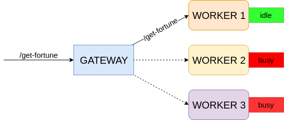

# What needs to be done?

There is an existing HTTP service. The service exposes a single endpoint `GET /get-fortune`.

You should be able to start three instances of this service locally using the following Docker Compose command:

`docker-compose up -d`

_NOTE:_ Don't forget to install one of the latest versions of Docker and Docker Compose first. 
See [here](https://docs.docker.com/compose/install/)

But there is a problem with this service: each service instance can only handle one request at a time, and just rejects exceeding requests.

## Objective

You need to implement an HTTP gateway service for the aforementioned service instances. This gateway service should do the following:

1. It should act as a proxy/load-balancer for the service instances behind it. I.e. it should expose the same `GET /get-fortune`
endpoint that must return responses received upon forwarding requests to one of the worker instances behind it.

2. It should handle gracefully bursts in the load by buffering requests and then forwarding them further when there is an idle
worker instance. E.g. even if there are only 3 worker instances, the gateway should be able to process 5 simultaneous 
requests without failures.

Schematically the architecture looks like this:

You can use any programming language and HTTP server implementation for this task (e.g. it can be Java, Scala, Python, NodeJS or anything else).

When you complete the implementation, please, send back the source code along with a short instruction how to launch your HTTP service.

_Good luck!_
